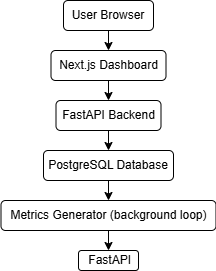

# Infrastructure Observability Platform

A full-stack observability platform that allows users to monitor simulated infrastructure metrics, trigger incident scenarios, and analyze system behavior through interactive dashboards.

The system generates synthetic metrics for multiple services and visualizes their health status, performance trends, and operational incidents in real time. Users can explore service-level metrics, investigate anomalies, and observe how simulated failures affect system behavior.

---

## Demo


---

## Features

• Real-time service monitoring  
• Simulated infrastructure metrics generator  
• Health score calculation for each service  
• Incident injection simulation  
• Time-series performance charts  
• Full Dockerized environment  
• Backend API for metrics and alerts  

---

## Technology Stack

### Backend

- Python
- FastAPI
- Prisma ORM

### Frontend

- Next.js
- React
- Recharts

### Database

- PostgreSQL

### Infrastructure

- Docker
- Docker Compose

---

## Dashboard Overview


---

## System Architecture



---

# Environment Setup

Before running the project, create a `.env` file in the project root.

You can copy the example configuration:

```bash
cp .env.example .env

Example .env configuration:

POSTGRES_USER=obs
POSTGRES_PASSWORD=change-me
POSTGRES_DB=observability
NEXT_PUBLIC_API_BASE_URL=http://localhost:8000
CORS_ORIGINS=http://localhost:3000

These variables configure:
PostgreSQL database credentials
Frontend API base URL
Backend CORS origins

Running the Project

1. Clone repository
git clone https://github.com/MazurPavel/observability-platform.git

2. Enter project
cd observability-platform

3. Configure environment variables
cp .env.example .env

4. Start with Docker
docker compose up --build

Access the application

Frontend Dashboard
http://localhost:3000

Backend API
http://localhost:8000

Metrics endpoint
http://localhost:8000/metrics/latest

Example Use Case

The dashboard simulates monitoring of multiple services in a production environment.

You can:

• observe live metrics
• track service health scores
• view time-series charts
• inject simulated incidents
• observe system degradation

Author

Pavel Mazur
