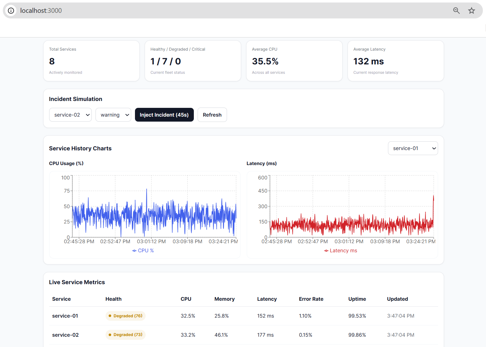
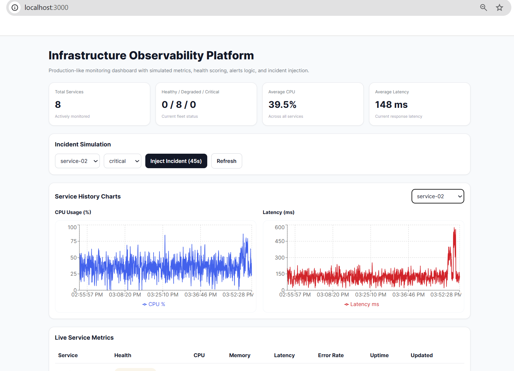
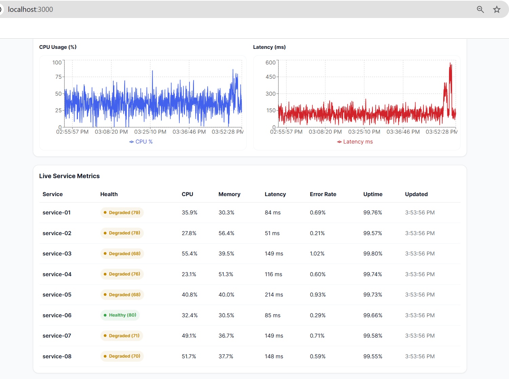

# Infrastructure Observability Platform

A full-stack observability dashboard that simulates real-time infrastructure monitoring.

The platform generates synthetic metrics for multiple services and visualizes their health status, performance metrics, and incidents through an interactive monitoring dashboard.

---

## Demo

---

## Dashboard Overview

---

## Incident Simulation

---

## Metrics Charts

---

## Architecture

---

# Features

• Real-time service monitoring  
• Simulated infrastructure metrics generator  
• Health score calculation for each service  
• Incident injection simulation  
• Time-series performance charts  
• Full Dockerized environment  
• Backend API for metrics and alerts  

---

# Technology Stack

### Backend
- Python
- FastAPI
- Prisma ORM

### Frontend
- Next.js
- React
- Recharts

### Database
- PostgreSQL

### Infrastructure
- Docker
- Docker Compose

---

# System Architecture

The platform follows a microservices-style architecture:

User Browser  
↓  
Next.js Dashboard  
↓  
FastAPI Backend  
↓  
PostgreSQL Database  

A background metrics generator simulates infrastructure behavior and stores metrics in the database.

---

# Project Structure
# Infrastructure Observability Platform

A full-stack observability dashboard that simulates real-time infrastructure monitoring.

The platform generates synthetic metrics for multiple services and visualizes their health status, performance metrics, and incidents through an interactive monitoring dashboard.

---

## Demo

---

## Dashboard Overview

---

## Incident Simulation

---

## Metrics Charts

---

## Architecture

---

# Features

• Real-time service monitoring  
• Simulated infrastructure metrics generator  
• Health score calculation for each service  
• Incident injection simulation  
• Time-series performance charts  
• Full Dockerized environment  
• Backend API for metrics and alerts  

---

# Technology Stack

### Backend
- Python
- FastAPI
- Prisma ORM

### Frontend
- Next.js
- React
- Recharts

### Database
- PostgreSQL

### Infrastructure
- Docker
- Docker Compose

---

# System Architecture

The platform follows a microservices-style architecture:

User Browser  
↓  
Next.js Dashboard  
↓  
FastAPI Backend  
↓  
PostgreSQL Database  

A background metrics generator simulates infrastructure behavior and stores metrics in the database.

---

# Project Structure
observability-platform
│
├── api
│ └── FastAPI backend
│
├── web
│ └── Next.js dashboard
│
├── screenshots
│ ├── architecture.png
│ ├── dashboard-overview.png
│ ├── incident-simulation.png
│ ├── metrics-charts.png
│ └── demo.gif
│
├── docker-compose.yml
└── README.mdobservability-platform
│
├── api
│ └── FastAPI backend
│
├── web
│ └── Next.js dashboard
│
├── screenshots
│ ├── architecture.png
│ ├── dashboard-overview.png
│ ├── incident-simulation.png
│ ├── metrics-charts.png
│ └── demo.gif
│
├── docker-compose.yml
└── README.md

---

# Running the Project

### 1. Clone repository
git clone https://github.com/MazurPavel/observability-platform.git

### 2. Enter project
cd observability-platform

### 3. Start with Docker
docker compose up --build

---

# Access the application

Frontend Dashboard:
http://localhost:3000

Backend API:
http://localhost:8000http://localhost:8000

Metrics endpoint:
http://localhost:8000/metrics/latest

---

# Example Use Case

The dashboard simulates monitoring of multiple services in a production environment.

You can:

• observe live metrics  
• track service health scores  
• view time-series charts  
• inject simulated incidents  
• observe system degradation  

---

# Author

Pavel Mazur
